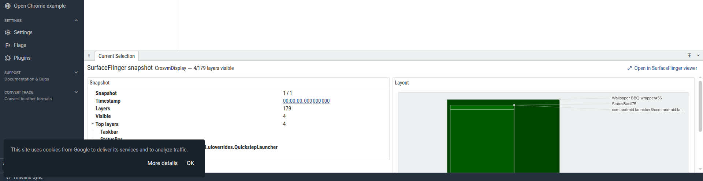
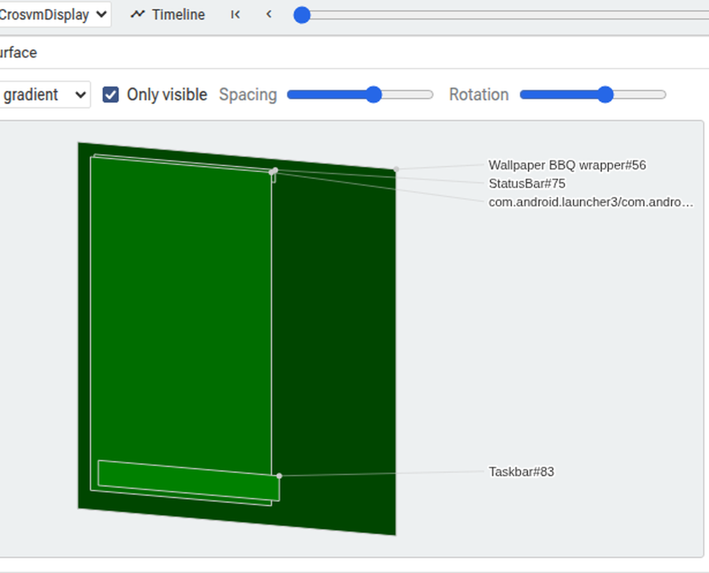
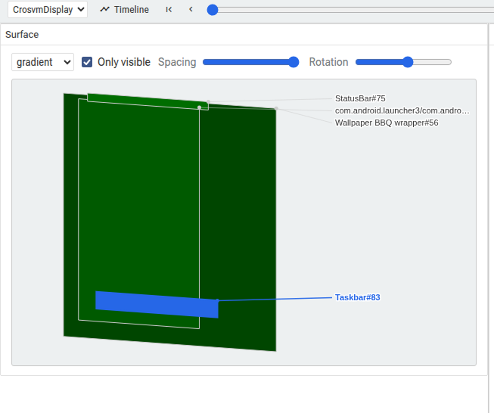
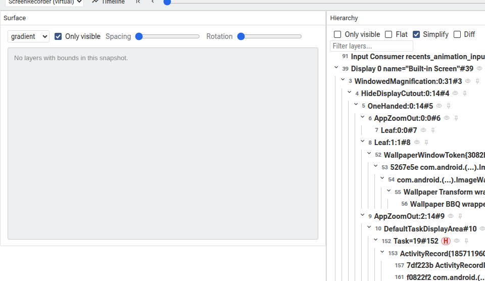
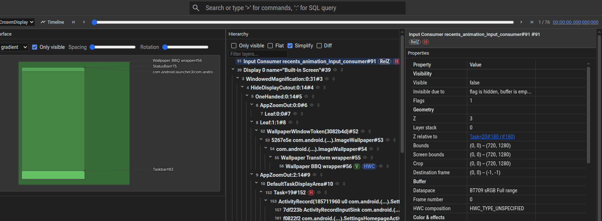

# Chapter 11 — Capture it yourself

*Prerequisite: Chapter 7 (what the panes are). This is the hands-on chapter: capture a layers trace, open it, and tour every feature with real screenshots from the plugin. If you've read this far, this is where it becomes muscle memory.*

---

## 11.1 Capture

You need a device or emulator with `adb`. The minimal config is just the one data source — **no ftrace padding** (the bounds fix, Chapter 5.6, is what makes a layers-only trace open):

```
# sf.cfg
buffers { size_kb: 32768 }
duration_ms: 5000
data_sources { config {
  name: "android.surfaceflinger.layers"
  surfaceflinger_layers_config {
    mode: MODE_ACTIVE
    trace_flags: TRACE_FLAG_INPUT
    trace_flags: TRACE_FLAG_COMPOSITION
    trace_flags: TRACE_FLAG_VIRTUAL_DISPLAYS
  }
}}
```

```bash
adb push sf.cfg /data/local/tmp/
adb shell 'cat /data/local/tmp/sf.cfg | perfetto --txt -c - -o /data/misc/perfetto-traces/sf.perfetto-trace'
adb pull /data/misc/perfetto-traces/sf.perfetto-trace
```

`MODE_ACTIVE` gives you a snapshot per frame (so you can scrub and diff). The three flags fill in the input regions, the HWC/GPU composition chips, and any virtual displays — i.e. exactly the columns the plugin renders (Chapter 4.5). Interact with the screen during the 5 s so there's something to see.

**To exercise multi-display**, run a screen recording during the capture — it creates a `ScreenRecorder` virtual display (Chapter 6.3):
```bash
adb shell screenrecord --time-limit 5 /data/local/tmp/rec.mp4 &
adb shell 'cat /data/local/tmp/sf.cfg | perfetto --txt -c - -o /data/misc/perfetto-traces/sf.perfetto-trace'
```

Then open `ui.perfetto.dev` (or your build), drop the trace, and look in the sidebar for **SurfaceFlinger**.

---

## 11.2 The timeline track

Expand the **SurfaceFlinger** group in the timeline: one track per display, each slice a snapshot labelled **"Frame N"** and colorized per frame (Chapter 7.8). Click a slice → the details panel opens with a compact summary on the left and an inline layout preview on the right, plus **Open in SurfaceFlinger viewer**:



Note the left column — **Snapshot 1/1, Timestamp, Layers, Visible, Top layers** — uses the same index/timestamp the full page shows, so moving between them is seamless. The right "Layout" preview is the same rects view as the page, scoped to this display.

---

## 11.3 The Surface (3D rects)

Open the full page (sidebar → SurfaceFlinger, or the details-panel button). The left pane is the Surface view. Drag **Rotation** and **Spacing** and the flat stack tilts into 3D, with **leader-line labels** in a right gutter — each label connected to its rect, never overlapping:



Push **Spacing** up and the layers fan apart along the depth axis so you can see the stack — and the leader lines follow each rect to its now-separated position:



Things to try:
- **Shading** dropdown: `gradient` (solid, darker by depth), `opacity` (each layer's real alpha), `wireframe` (borders only).
- **Only visible** toggle: off shows the invisible layers too (greyed). On an encoder/virtual display whose only layer is an invisible mirror, the surface says *"No visible layers — N hidden. Uncheck 'Only visible' to show."* (Chapter 6.3) — that's expected, not a bug.
- **Click a rect or its label** → selects that layer (highlighted blue), and the Hierarchy + Properties update.

The whole thing is a pure 2D canvas (Chapter 7.3), so it renders even headless — where the standalone Winscope's WebGL view is blank.

---

## 11.4 The Hierarchy

The middle pane is the layer tree. Each node shows the layer id, name, and **chips** (Chapter 7.6): **V** (visible), **GPU**/**HWC** (composition type), **RelZ**/**RelZParent**, **H** (hidden), **MissingZ**, **Spy**, **Dup**. Controls: **Only visible**, **Flat**, **Simplify** (collapse long dotted names), **Diff**, and a filter box (which keeps a matched layer's ancestors so the path stays visible). Each node has hover **hide** (👁) and **pin** (📌) buttons; both persist as you scrub (they're keyed by layer id).

Turn on **Diff** and scrub: added layers tint green, modified amber, deleted red (ghost rows). The diff is exact — it compares each layer's interned proto id against the previous snapshot (Chapter 5.1, 7.2).

---

## 11.5 The Properties

The right pane. A **header card** (selected layer name + chips), then a **curated** DataGrid grouped into sections — Visibility (incl. occluded-by/covered-by as clickable layer links), Geometry, Buffer, Color & effects, Input — then the **full proto dump** as a filterable DataGrid (toggle **Show defaults** to include zero/empty fields). With Diff on, the proto grid gains a **Previous** column showing what changed.

Clicking a layer reference (e.g. "Occluded by: StatusBar (#75)") jumps the selection to that layer — the whole UI follows.

---

## 11.6 Multiple displays

If your trace has more than one display (e.g. you ran `screenrecord`), the selector at the top lists them all, with virtual ones marked **"(virtual)"**. Pick a display and the Surface re-scopes to *its* composition (its `group_id`, Chapter 3.4); the Hierarchy stays the full cross-display tree. Here's the `ScreenRecorder` virtual display selected — its only layer is an invisible mirror, so the surface shows the actionable empty message while the hierarchy still lists everything:



This is the honest representation from Chapter 6: the recorder is a real SF display you can inspect, not hidden.

---

## 11.7 Light & dark

The plugin is themed entirely with Perfetto's CSS variables, and the canvas reads the same variables via JavaScript (Chapter 7.3, 7.10), so it follows the app theme with no per-mode code. Toggle dark mode and everything — panes, hierarchy, properties, and the canvas rects/labels — retheme together:



---

## 11.8 The two round-trips

- **Timeline → page:** click a snapshot slice → its details panel → **Open in SurfaceFlinger viewer** → the page opens on that frame.
- **Page → timeline:** the **Timeline** button selects that snapshot's slice on the display's track and scrolls to it.

Because both surfaces read one shared session and show the snapshot index + timestamp identically, you can move between the quick timeline peek and the deep page without losing your place. That's the whole point: layer structure, on the same timeline as everything else Perfetto knows about the frame.

[« Chapter 10](10-transactions-and-other-viewers.md)  ·  [README](README.md)  ·  [UI deep-dive (line-by-line) »](ui-deep-dive.md)
